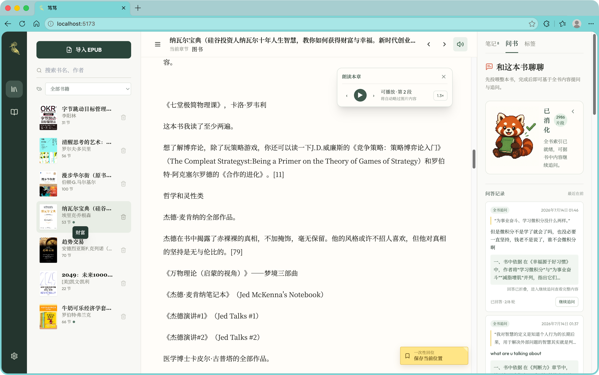
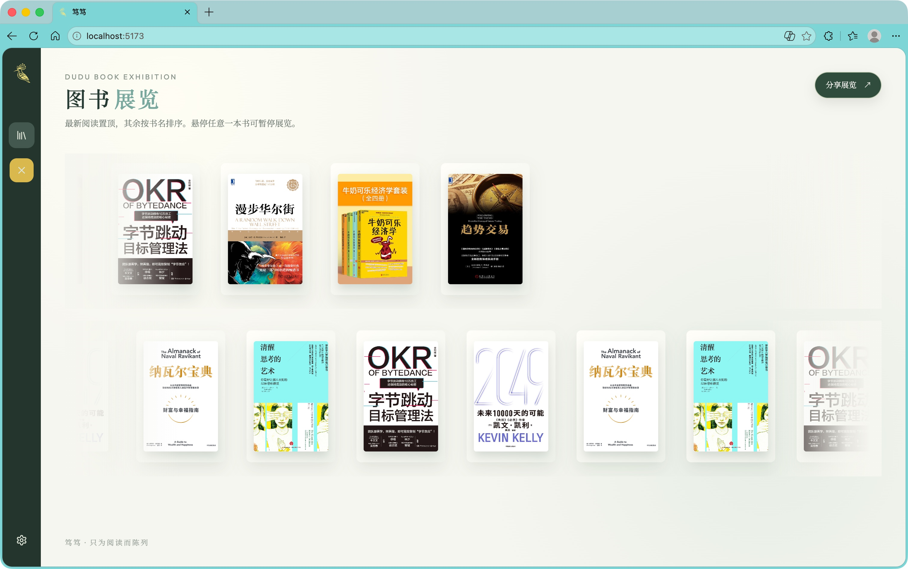

# 笃笃

笃笃是一款本地优先的 EPUB 阅读器。它把阅读、标注、朗读和基于整本书的 AI 问答放在同一处，书籍、阅读进度、笔记、RAG 索引与问答记录都保存在本机。





> 当前版本面向个人使用与本地开发；仅支持无 DRM、可重排版 EPUB。

## 已实现功能

- EPUB 导入与解析：封面提取、目录识别、章节跳转、重复文件名拦截。
- 阅读体验：阅读位置记忆、左右翻页定位提示、目录抽屉、图书展览、书架搜索与删除书籍。
- 标注与笔记：拖选高亮、备注、查看/编辑/删除、笔记定位与持久化。
- 标签：书籍最多五个标签，标签管理与筛选。
- 朗读：Edge 免费 TTS、段落切换、进度续播、0.5–2.0× 倍速、跟读高亮、跳过图片、可移动播放器。
- 问书：全文投喂生成本地 RAG 索引、选文追问/全书追问、DeepSeek 回答、问答历史与最多八轮连续追问。
- 模型设置：可在界面左下角保存 DeepSeek API Key；密钥仅以脱敏形式展示，后端加密存储。

## 技术架构

| 层级 | 技术 |
| --- | --- |
| 前端 | React、TypeScript、Vite、Tailwind CSS |
| 后端 | FastAPI、SQLAlchemy、ebooklib |
| 数据 | PostgreSQL 16 + pgvector |
| 朗读 | Edge TTS，可扩展本地 TTS Provider |
| AI | 本地 RAG 索引 + DeepSeek API 服务端代理 |
| 运行 | Docker Compose |

## 一键启动

需要安装并启动 Docker Desktop。

```bash
./scripts/dudu.sh start
```

首次运行时，启动器会在缺少 `.env` 时由 `.env.example` 创建模板。随后访问：

- 阅读器：<http://localhost:5173>
- 后端健康检查：<http://localhost:8000/health>
- API 文档：<http://localhost:8000/docs>

常用命令：

```bash
./scripts/dudu.sh start     # 构建并启动前端、后端、数据库
./scripts/dudu.sh stop      # 停止服务，保留书籍与数据库数据
./scripts/dudu.sh restart   # 重启全部服务
./scripts/dudu.sh status    # 查看容器状态
./scripts/dudu.sh logs      # 查看实时日志
```

也可以直接使用 Docker Compose：

```bash
docker compose up -d --build
docker compose down
```

## 配置 DeepSeek

1. 启动笃笃后，点击左下角齿轮图标。
2. 输入 DeepSeek API Key、API 地址和模型名称并保存。
3. 或在项目根目录 `.env` 中设置 `DEEPSEEK_API_KEY` 后重启服务。

前端配置的密钥优先于 `.env`。不要提交 `.env`、`ds.env` 或任何包含真实密钥的文件。

常用环境变量：

```dotenv
DEEPSEEK_API_KEY=
DEEPSEEK_BASE_URL=https://api.deepseek.com/v1
DEEPSEEK_MODEL=deepseek-chat
APP_ENCRYPTION_KEY=请替换为一段随机长密钥
DB_PASSWORD=change-me
```

生产部署必须设置独立的 `APP_ENCRYPTION_KEY`，并通过 HTTPS 访问。

## 数据与隐私

- EPUB 文件、封面、笔记、阅读位置、RAG 索引、问答记录均储存在本地 Docker 卷。
- AI 提问时，后端会将选文/检索片段与问题发送给已配置的模型服务商。
- Edge TTS 需要联网请求微软语音服务；本地 TTS Provider 可在后续扩展。
- 停止服务使用 `./scripts/dudu.sh stop` 或 `docker compose down` 不会删除数据。只有执行 `docker compose down -v` 才会删除数据库、书籍与 TTS 缓存。
- PostgreSQL 不默认暴露到宿主机 `5432`，避免与本机已有数据库冲突；笃笃后端通过 Docker 内部网络访问数据库。
- 启动器会自动避开已占用的 `5173`、`8000` 端口，并在启动完成后打印实际访问地址。需要固定端口时可设置 `DUDU_FRONTEND_PORT`、`DUDU_BACKEND_PORT`。

## 当前限制

- 不支持 DRM EPUB、固定版式 EPUB、漫画/OCR 和账号云同步。
- 复杂 EPUB 的目录、封面与章节解析会因出版格式不同而有差异。
- RAG 适合个人书库的本地索引；超长书籍会受字符上限限制。
- “图书展览”是纯展示页，不支持从该页打开或操作书籍。

## 开发验证

```bash
cd frontend
npm install
npm run build
```

后端和前端均通过 Docker Compose 启动。项目版本快照位于 [`version1/`](version1/)。
